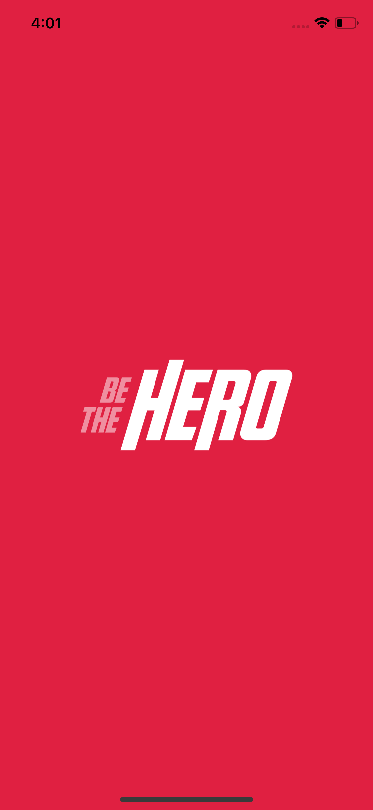
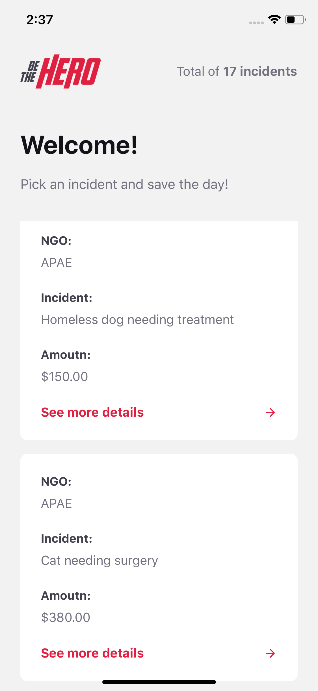
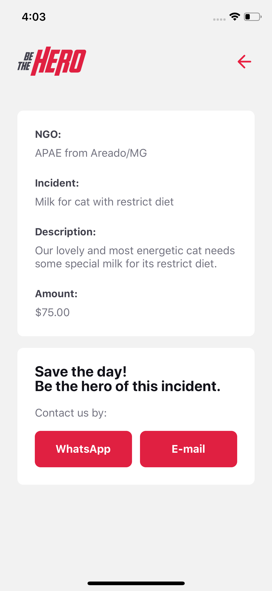

This is an application to colaborate to nongovernamental organizations that helps people, animals, environment or any other cause they fight for, to address their problems to people that might finacially help these instituitions.

This initiative intented to learn more about the tecnologies that compose this project:

* Node.js:
	* Express;
	* Knex;
	* CORS;
* React JS:
	* Axios;
	* React-Router-DOM;
* React Native:
	* Axios;
	* Expo;

Minor automated unit and integration tests were done using:

* Jest
* Supertest
* Celebrate

## Deployment  

To install all the dependencies and deploy this project you have to have installed **Node.js** and **npm** in your machine.

To deploy this project, clone this repo and lauch the server first:

```bash
cd backend/
npm install
npm start
```  

To deploy the webpage that uses react, do the same:

```bash
cd frontend/
npm install
npm start
```
  
Finally, to deploy Expo and try out the mobile application you must have the Expo app installed in your mobile phone or an Android or iOS device simulator installed in your PC. Then, you can execute expo by typing:

```bash
cd mobile/
npm install
expo init
```  

As the Expo application lauches, a QR Code will be generated and you can scan it with your mobile device. This will open the project in your phone inside Expo and you'll be able to try this feature out.

## Screenshots





Feel free to contribute to this project :smile:!